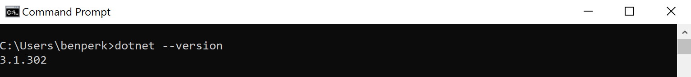
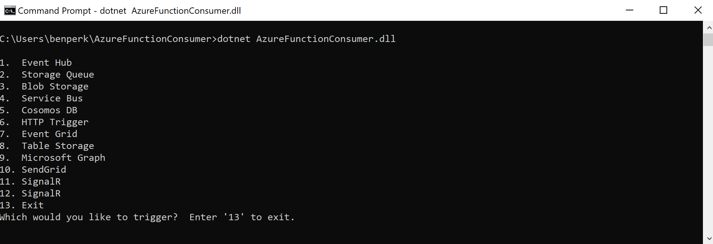
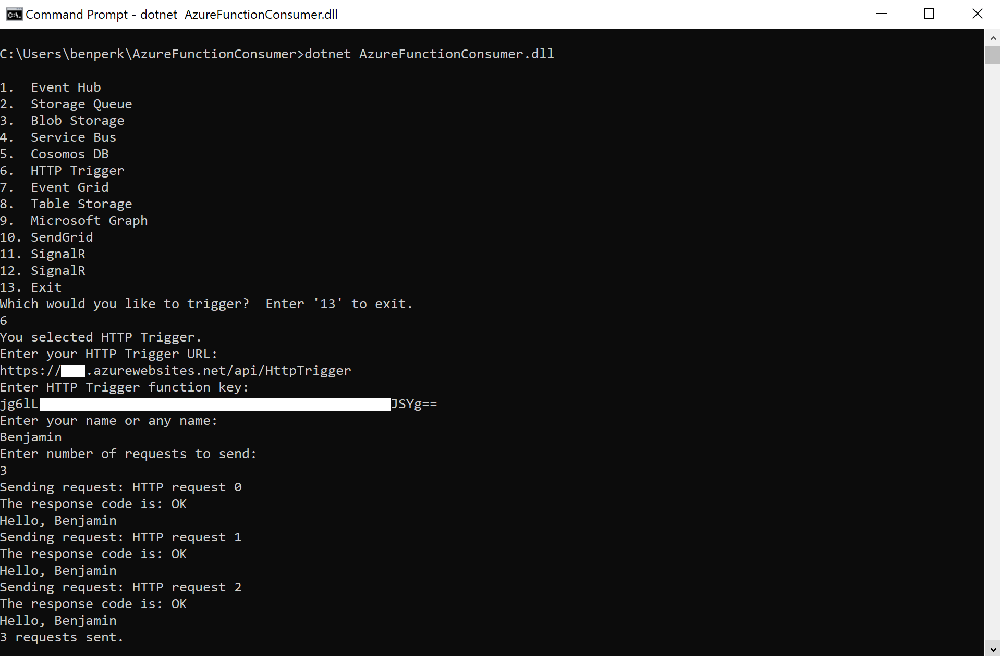
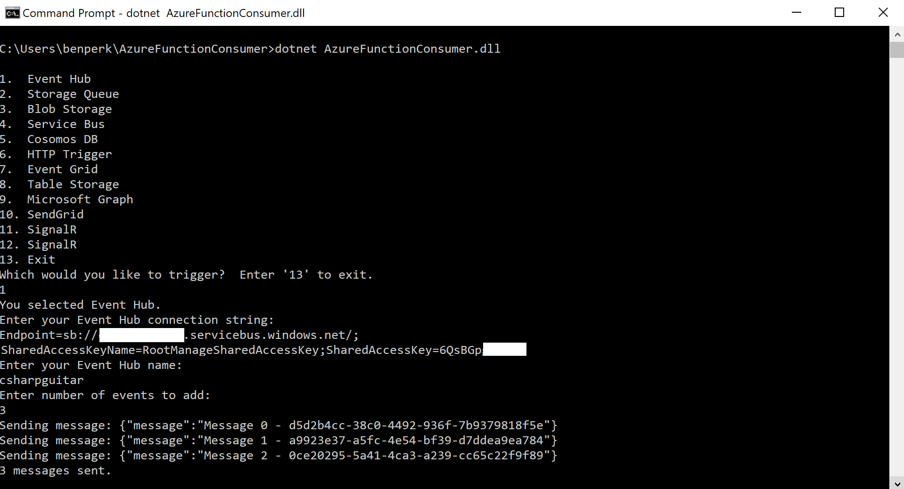
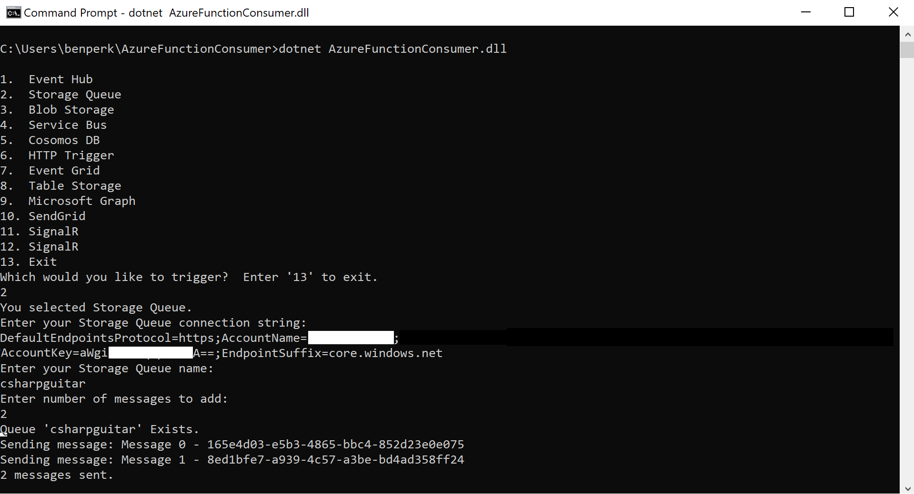
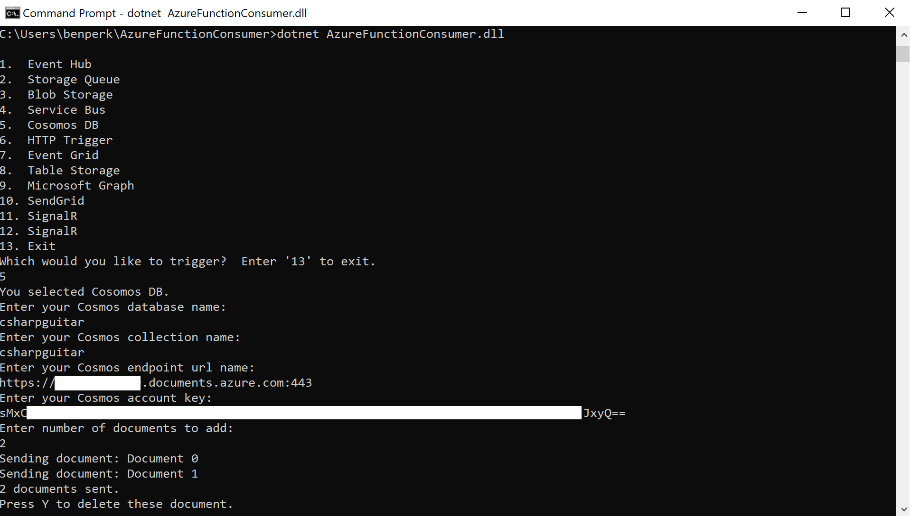

# Azure Function Consumer
The Azure Function Consumer is a .NET Core console app to consume Azure Functions. This program let's you send blobs, messages or documents to Azure resource which are bound to an Azure Function.  There are a few Labs available [here][LINK1] that will wlak you through the creation of an Azure Function and binding it to supported Azure product.  When you send blobs, messages or documents to an Azure product that is bound to an Azure Function, the Azure Function is triggered and the code within your Azure Function is executed.

The Azure Function consumer requires the dotnet runtime, which can be downoaded from [here][LINK2] and configured following the provided instructions.

To see which version of the .NET Core runtime you have installed, enter **dotnet --version**

Start the program by runnung:  **dotnet AzureFunctionConsumer.dll**

The Azure Function Consumer currently supports sending data transmissions to:
+ Event Hub
+ Storage Queue
+ Blob Storage
+ Service Bus Queue
+ Cosmos DB
+ HTTP Trigger

## Download the Azure Function Consumer program ##
Download the AzureFunctionConsumer.dll and its dependencies from [here][LINK3].  Take the most current version.

## Examples ##
The following examples illustrate how to trigger an HTTP, an Event Hub, Storage Queue and an Azure Cosmos DB bound Azure Function

### HTTP Triggered Azure Function ###

### Event Hub Triggered Function ###

## Storge Queue Triggered Function ##

## Azure Cosmos DB Triggered Function ##

[LINK1]: https://www.thebestcsharpprogrammerintheworld.com/2020/07/06/azure-functions-labs-information-and-setup-instructions/
[LINK2]: https://github.com/dotnet/core
[LINK3]: https://github.com/benperk/AzureFunctionConsumer/releases
